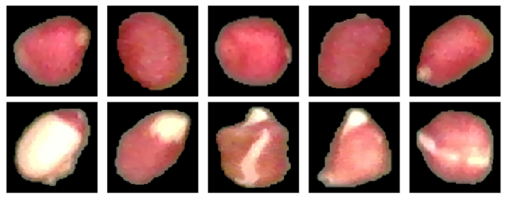
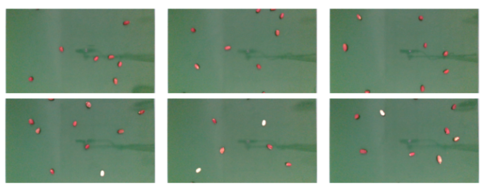
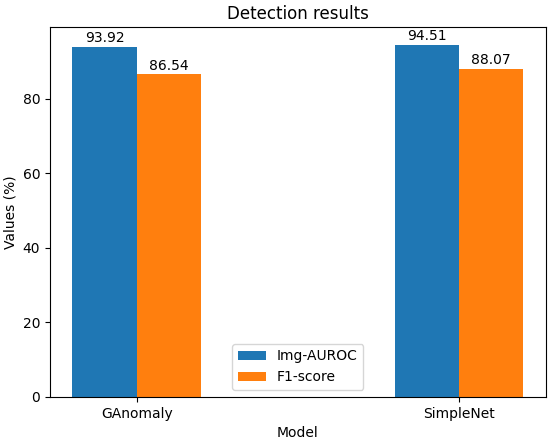

# PeanutAD: A Dataset for Peanut Anomaly Detection

Welcome to the PeanutAD dataset, a unique collection of images captured using an [Intel Realsense](https://www.intelrealsense.com) camera. This is a brand new dataset for Industrial Anomaly Detection, which effectively incorporates real-world features of agricultural manufacturing processes.

## Data Collection

The data collection process involves a top-down view camera setup with a resolution of 1920x1080. The camera is strategically positioned 50 cm above the conveyor belt, capturing images at a rate of 1 FPS. We've meticulously separated normal peanuts from abnormal ones to facilitate easy data labeling.

## Getting Started

To start using the PeanutAD dataset in your project, please get download [in this google driver's url](https://drive.google.com/drive/folders/1-9GBEeBOzXXdFJRMR--LDcAVNWE5qIMr?fbclid=IwZXh0bgNhZW0CMTAAAR0xdfBC-GOkmzcYpWHdK2LSs21n7rntHVj5hOXbBllPXVZgA91agxN0qqs_aem_AeABmgR8TieXHcLa63dDYgjDraeO3YOdPgUW2EKfq7DZClmFnqiUxjAEdAAlgqfavAh5tdrUGowoMGckVIvJ5-pc).

## Benchmark Models

We've benchmarked the PeanutAD dataset on several models:

| Model | Source Code | Year Published |
| ----- | ----------- | -------------- |
| [GANnomaly](https://arxiv.org/abs/1805.06725) | [GitHub](https://github.com/openvinotoolkit/anomalib) | 2018 |
| [SimpleNet](https://arxiv.org/abs/2303.15140) | [GitHub](https://github.com/DonaldRR/SimpleNet) | 2023 |

The performance of these models on our PeanutAD dataset is visualized in the following figure:

## Future Work

We're planning to extend this dataset to include more agricultural products and diverse anomaly detection scenarios. Our goal is to add more challenging cases and diversify the anomalous features.

## Citing Us

If you use the PeanutAD dataset in your research, please cite our paper:
